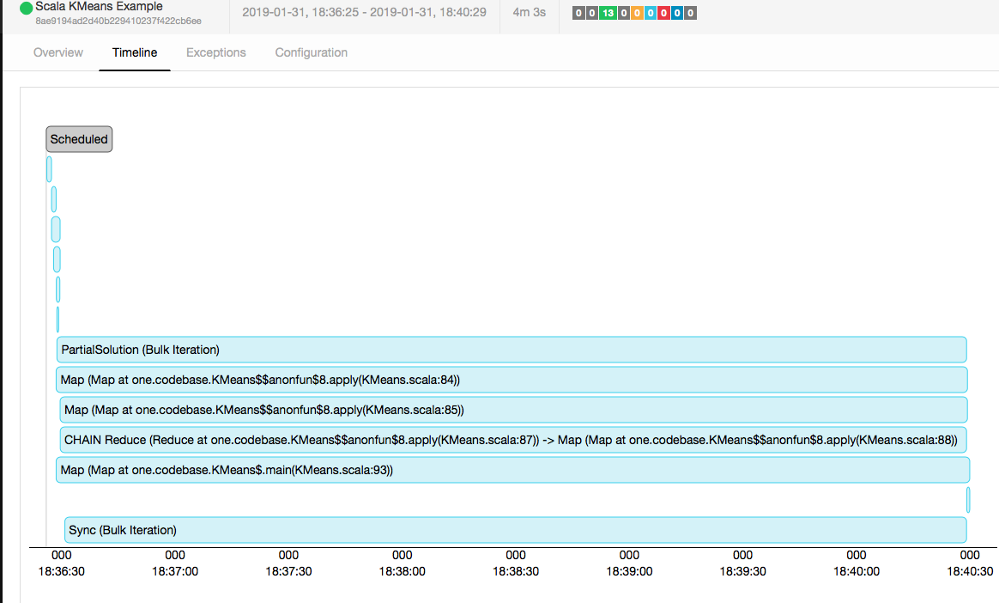

###### word count

On one local machine:
On could assume it would be disk bound, as the computation is not very intensive, however, the timeline 
clearly shows that most time is spend aggregating the sum. 

This might be because data has to be synchronised between the threads that filter 
the data and the threads that sum the word count. The window is keyed, meaning that a word that is processed by any 
thread will have to be send to a specific thread for sum aggregation. So the program is somewhat network 
(in this case because it is local inter thread communication) bound.

On cluster:
On the cluster this task was much more memory bound as our virtual machines had only very little memory. 

###### k-means

Local execution on one machine.

As can be seen by the graphic the program is highly compute bound and spends most 
of its time in map and reduce. However the program is also network bound as it needs to 
synchronise the centroids after every iteration. Memory only comes in to play if larger 
files are analysed. Increasing the iteration only has effects on network and cpu. 
Increasing k has a small effect on memory as more centroids have to be stored, however, it 
is negligible compared to increasing the changing from berlin.csv to germany.csv. 
Using the germany file will also require a lot more computational effort. 
Disk is not a limiting factor as it only requires a fraction of the time, 
as can be seen in the picture. 
Looking at the dashboard, the data already seems to be well partitioned 
by flink. In all. tasks each instance runs with a similar amount of data, only
 in one case when computing the distinct lte towers, on instance does not produce any results.  

On cluster: 
Unfortunately we could not get the Flink Dashboard to submit the task correctly. I did execute, however, the execution 
differed from the usual one. We suspect that it had something to do with batch vs. stream processing and that because of 
some dependency Flink thought it would be a stream processing job. Unfortunately, we could not narrow it down more.
Ironically, flink run kmeans.jar worked locally with the same jar file, also showing the correct execution plan in the 
dashboard.
